# CNC PCB Tools

This document discusses an entire end-to-end process of milling PCBs with
a "cheap" 3018 CNC machine (although other machines could also apply).

Part of that process, verifying the design and calibrating the machine, are
helped along with simple Python scripts that I created and am giving away
for free.  This document explains how to to use these optional tools in
the appropriate places in the process.

Even if you do not use the tools, I think there this document contains
helpful information, both for beginners and more experienced individuals
looking to compare notes.

### Effort Estimate

This ended up being a long document.  Does that mean that the process takes
a long time?  I don't think it does.  Here are some time estimates:

| Step         | Beginner / Small Project | Experienced / Small Project | Experienced / Medium Project |
|--------------|--------------------------|-----------------------------|------------------------------|
| Design PCB   | 3 hours                  |  1 hour                     | 4 hours                      |
| Create GCode | 1 hour                   |  10 minutes                 | 15 minutes                   |
| CNC Setup    | 1 hour                   |  15 minutes                 | 15 minutes                   |
| CNC Cutting  | 15 minutes               |  15 minutes                 | 1 hour                       |
| Learning     | 1 hour                   |  -                          | -                            |
| **Total**    | **~6 hours**             |  **~2 hours**               | **~ 6 hours**                |

Of course there are many variables.  For example, if you use someone else's
PCB layout, you can cut that out of the time needed.

## Disclaimer

I have tested these tools and process and they work well for me.  That said, I
accept no responsibility for any damage caused to either person or equipment
that occurs from following advice in this document or running any of the
provided or mentioned software.

If you are a beginner to CNC, I have special "Tips" sidebars throughout the
document the CNC section that should be helpful.

## Gallery

Let start by looking at some example results.

First, a fast rise edge generator, as explained in
[this video](https://www.youtube.com/watch?v=9cP6w2odGUc).
This one was created for through-hole parts.

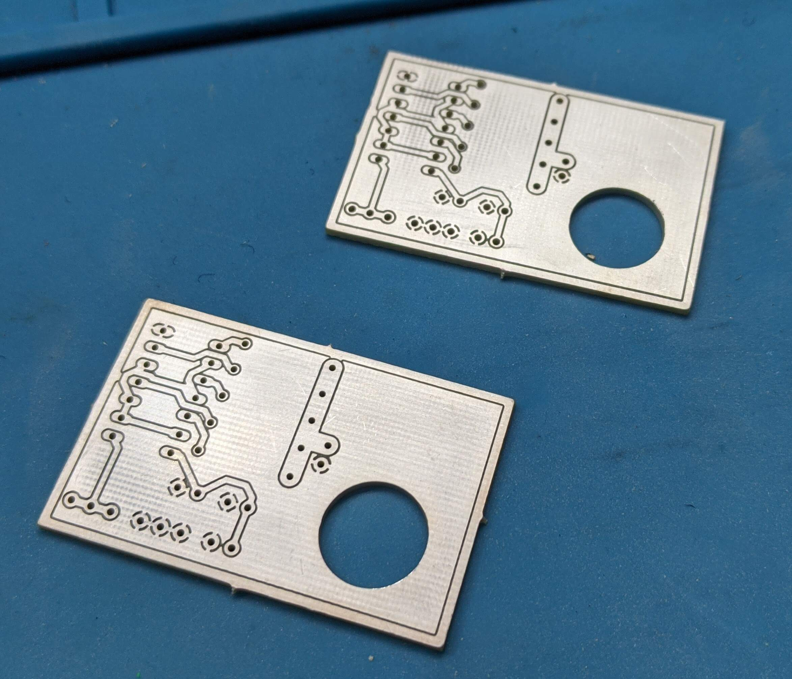
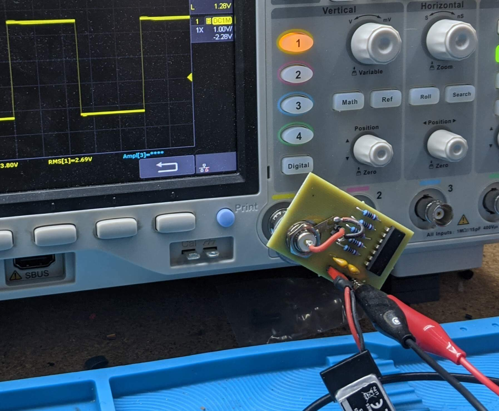

Here is a simple SMD board that uses a 555 and counter chip to make a simple
LED light show.  This one is still on the CNC machine:

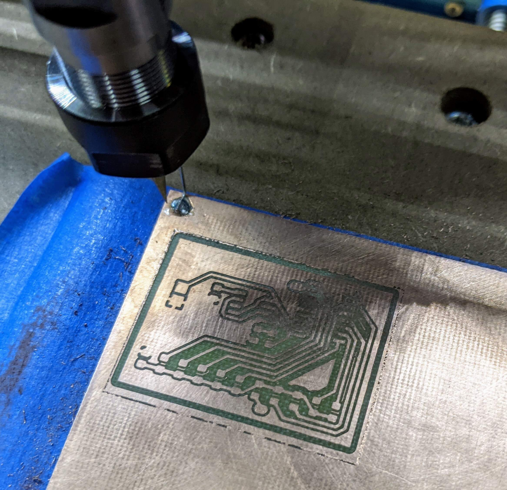

Here a simple voltage cutoff circuit I made that combines an ATTiny85,
MOSFET and a fuse for good measure.

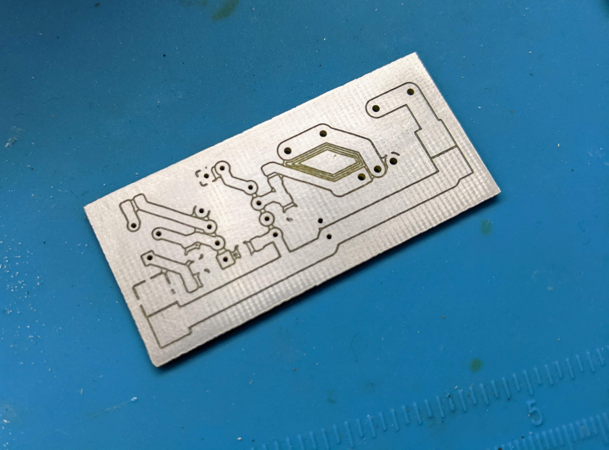
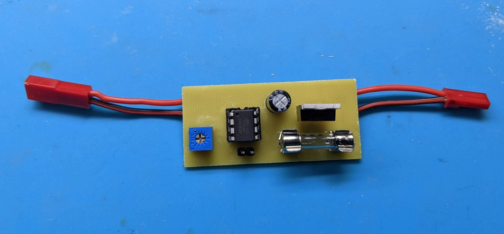

Here is an [e-paper based clock](https://github.com/mattwach/epaper_clock)
that I designed earlier this year.  I created
the first copy using a CNC machine, then made 4 more using boards from
a fab.  The first CNC copy was very useful in helping me discover
most of changes I wanted to make to the design (mostly layout) before
submitting the PCB. 

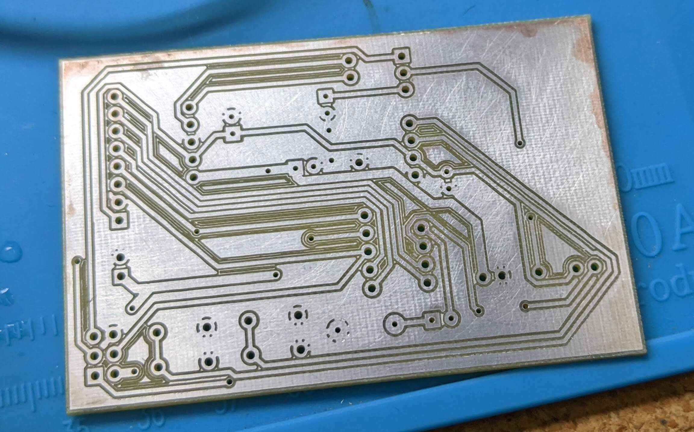
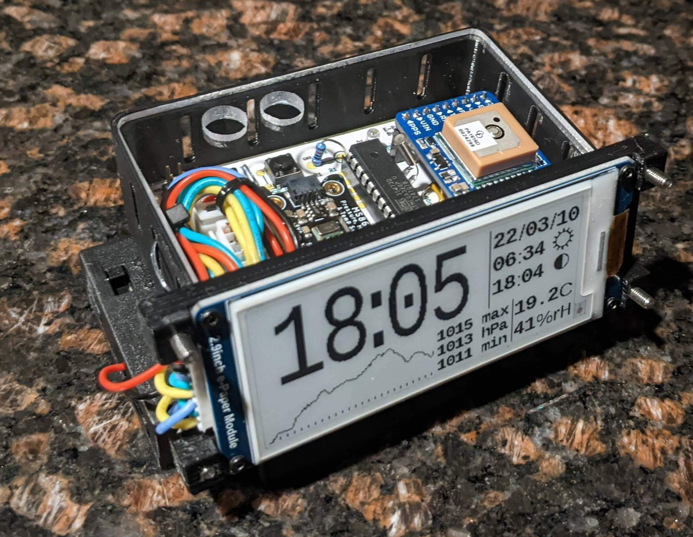
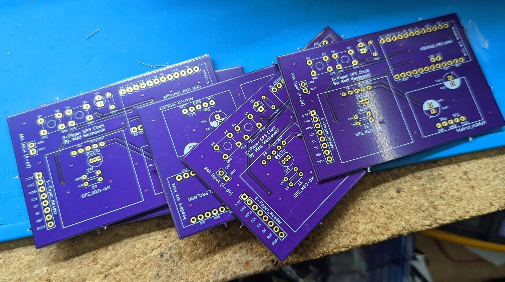

## Why CNC a PCB?

I've tried the following methods:

   * Breadboard
   * Prototype Boards
   * CNC (this doc)
   * Ordering a PCB from a fab, such as [oshpark.com](http://oshpark.com) or [www.pcbway.com](http://www.pcbway.com)

I feel that all of these methods have their place - it just depends on the
project.  Below I'll give my opinion on each one while trying not to go
overboard:

### Breadboard

Breadboards are great for trying something out in a short time.  Parts are
also not "consumed" and can be reused.  Using prebuilt modules as components
makes wiring simple and there are many cheap ones available.

However, any interconnects in your design will be performance limited in terms
of frequency, stray capacitance, unintended resistance and lower reliability.
It's not all bad since you get to exercise some troubleshooting skills and
things seems to work fine most of the time.

Also the method is not suitable for anything permanent.

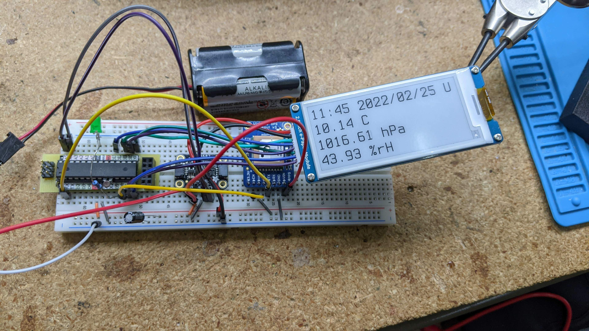

### Prototype Boards

Like a breadboard but with better reliability and more permanence.  Making
one of these is a bit labor intensive though and there are few economies of
scale when making multiple copies.  Frequency is also usually limited
due to the lack of careful layout, stray capacitances and the lack of
a ground plane.

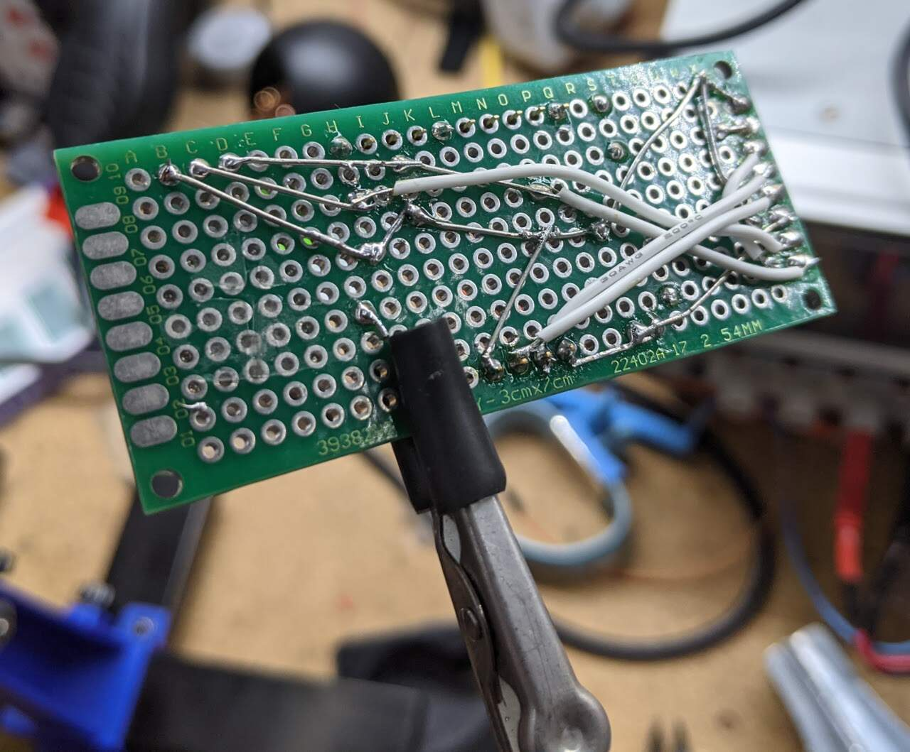
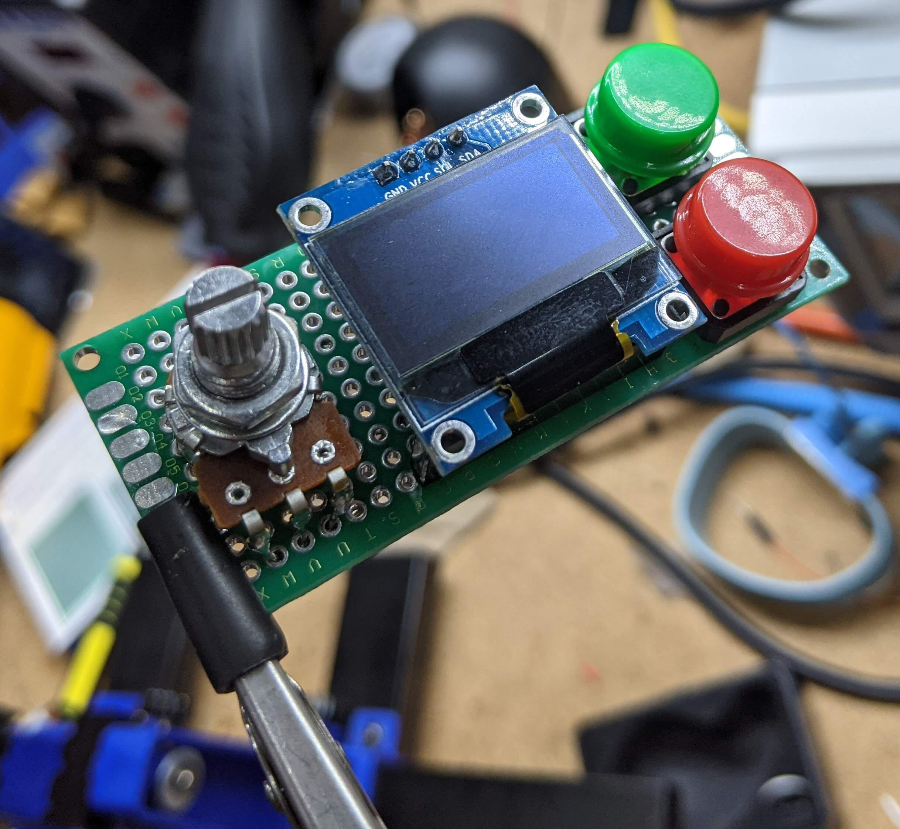

## CNC

Simple double sided boards are easy (often just a few patch wires are required
on the back side and these can be executed by drilling holes and hand routing
wires on the back).  Complex double sided is possible but requires alignment
techniques that are out-of-scope for this guide.

Performance is excellent.  Both SMD and through-hole components are supported.

Soldering is less convenient than a manufactured PCB due to lack of a solder
mask.  Lack of a silk screen (labeling) means that you may need a PCB printout
to guide component placement.

Requires some learning to be successful - that's the purpose of this document!

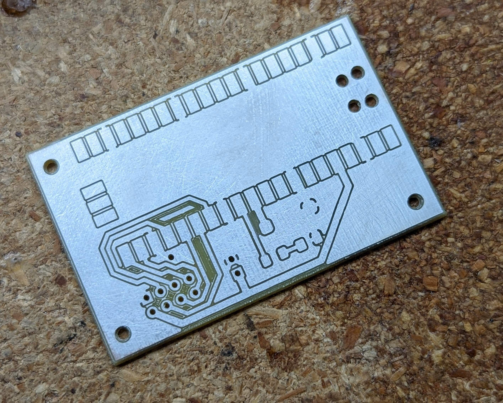
  
### Chemical Etch

I have not tried this one yet (and am meaning to soon) but have read and
watched videos on the process.  Overall, it seems similar to CNC - perhaps a
bit easier to dial in the process and get good results.  There are some clear
downsides however.  One is having to work with some nasty chemicals that
literally dissolve metal.  A second drawback is that drilling holes and cutting
out the board are not handled by the process so you'll have to come up with
something.

## Ordering a PCB

If you need a lot of copies, > 2 layers, or have a complex design, this is your
route.  You also get a solder mask for easier soldering and a silkscreen to
label component and provide other notes.

Turn around latency is around a week.  Cost is in the $20-$60 range assuming
that your board design is perfect.  If not, you'll consume additional weeks and
$$$ on iterations (or you can try to hack in workarounds).

## CNC Trip Points

I think a reason that many people avoid CNC is the upfront learning
curve.  Breaking a bit is easy and the risk of doing so increases
for any of the following reasons:

   1. You use the wrong parameters (feed rate, cut depth) either because you
      don't know or accidently type in the wrong number somewhere.
   2. Your GCode file (which the CNC takes as an input) neglected to command
      the motor to spin up.
   3. You don't zero the machine properly.
   4. You don't build a height map or improperly set one up
   5. Your copper clad is bowed due to improper clamping
   6. You are using unnecessarily aggressive design constraints, such as a
      0.2mm track width when 0.4mm could work for your project.

I'm going to talk about how to mitigate each of the problems about so your
success rate and quality can be quite high.

## Process Overview

Here is an overview of the steps I will cover.  But first, let's acknowledge
that everyone's situation, available tools, and skill sets are different.  The
process I describe below is what works for me, your ideal process will likely
end up being different, but it's good know what works for others.

Also, there could be better or more efficient ways of doing the things I
describe below.  If you think that is the case, let me know!

An overview of the steps:

  * **Design the PCB** (printed circuit board).  Here you create (or get) a
    schematic and layout a PCB.  The PCB you layout can be used for many
    purposes.  For example, you could take the same PCB design, checmical etch
    it, CNC it and send it to a fab.  That said, an "optimal" layout will take
    the final manufacturing process into consideration.
  * **Plot the PCB** design in a universal format know as "Gerber".  Gerber format
    is one that PCB manufacturers will accept as input when then make boards
    for you.  If you are into 3D printing, you can think of Gerber as "STL
    for circuits."
  * **Convert the "Gerber" file to "GCode"**.  GCode is a text file of instructions
    for a specific model of automated machine (CNC machines, 3D printers and 
    others).  The GCode file tells the machine where to cut, how fast to cut,
    how deep to cuts, etc.  None of this information is in the Gerber file -
    the conversion step adds it in.
  * **Setup the machine, execute the `.gcode`**.  
  * **Finishing work**.  Just a little bit of post work for CNC and you are ready for
    soldering.

## Designing your PCB

Some PCB's needs very fine traces and spacing to allow for placement of tiny
SMD components.  These are possible with CNC but not an ideal first project.
While learning, a more forgiving project will help you be
successful as you learn.  Thus my suggested starter project is a simple SMD
button adapter for breadboards.

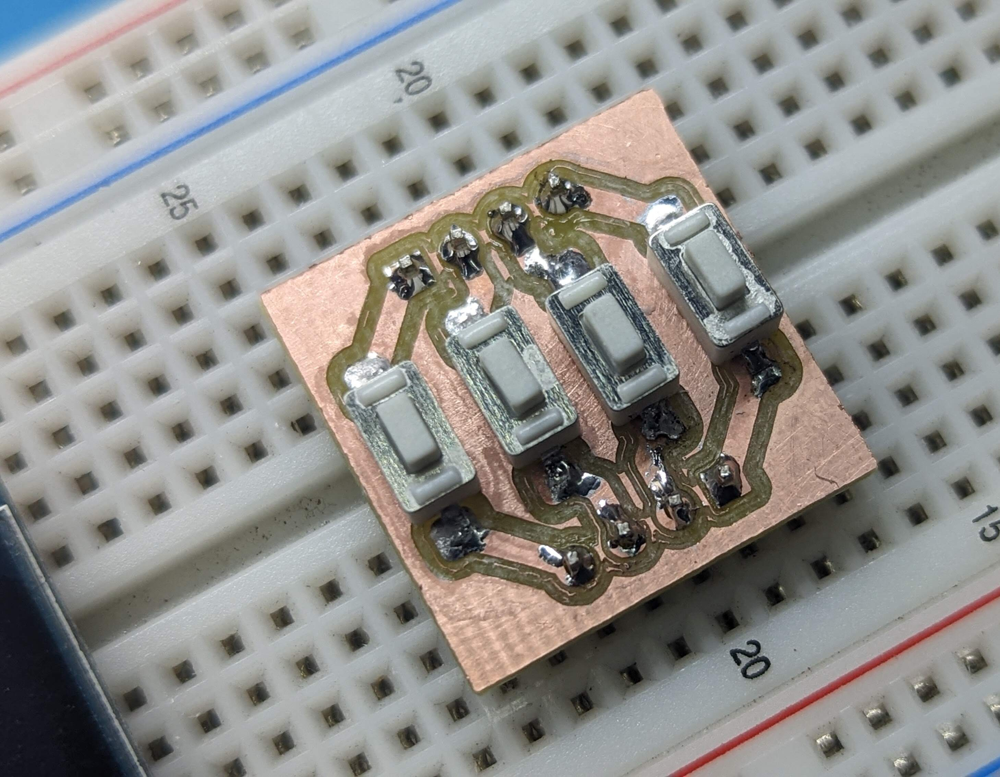

It's nice because:

   * Simple: No getting sidetracked on how the circuit works
   * Useful: A lot of buttons work so-so when fit in a breadboard.  This one
     give a very solid and reliable connection.
   * Small: It's fast and cheap to iterate and experiment with different
     settings.
   * Forgiving design: Thick traces (1mm) and large clearances (0.4mm) mean
     that the result can be usable even if the settings still need tweaking.

I'm going to use KiCAD.  I used to use Eagle but many agree that KiCAD has
surpassed it.  Eagle and many others will still work fine,
however, as they can all export Gerber plots.  Here is the schematic:

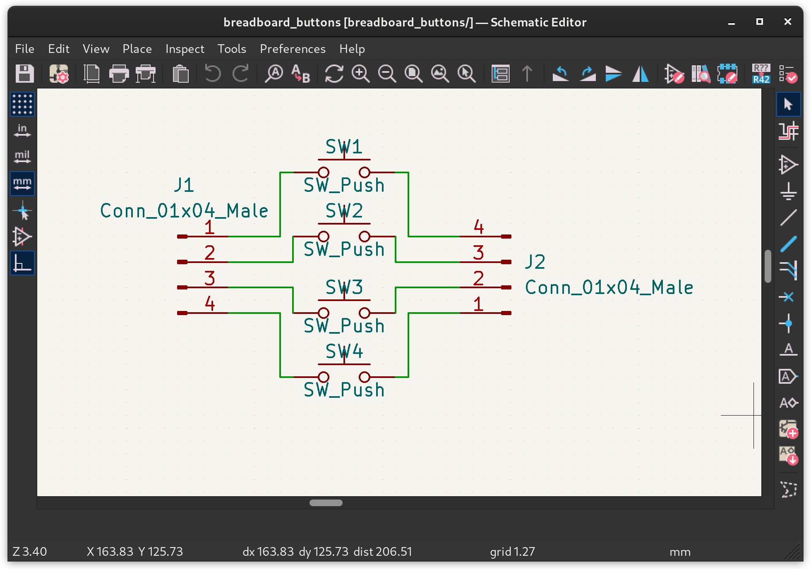

This design has two pin headers and 4 buttons.  For the Pin header PCB
footprint, I'm just using a pin header built into the standard library:

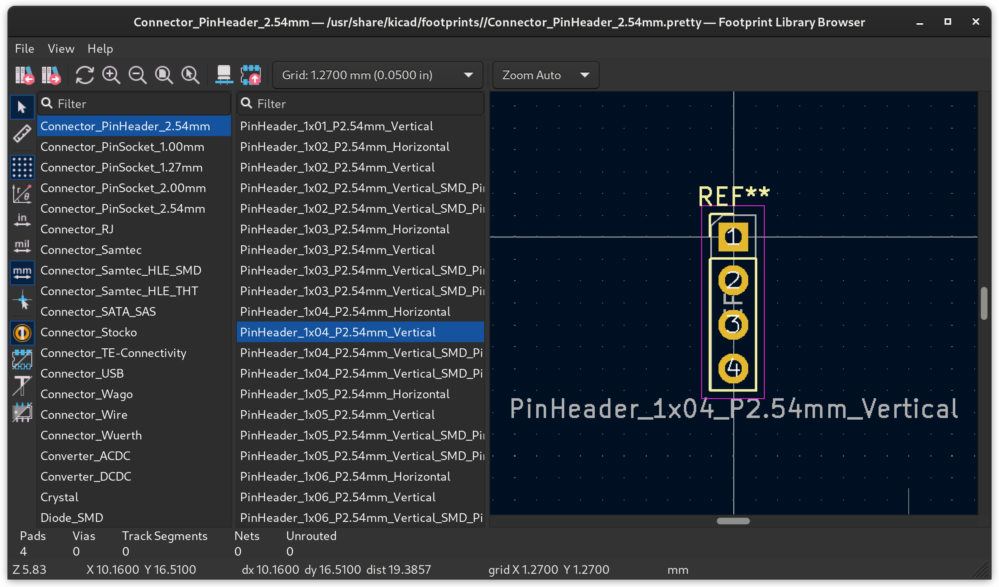

If you are just starting with KiCAD, one way to set the footprint is to click
on it in the schematic, then type "e" to bring up its dialog, where you can
select the footprint:

If this is new information for you, then I suggest watching some of
[John's Basement KiCAD tutorial](https://www.youtube.com/playlist?list=PL3by7evD3F51fKkyrUbH-PCdwPCWc9F8a)
(or similar).

Here are the SMD buttons I chose.  They are 6x3.5mm:

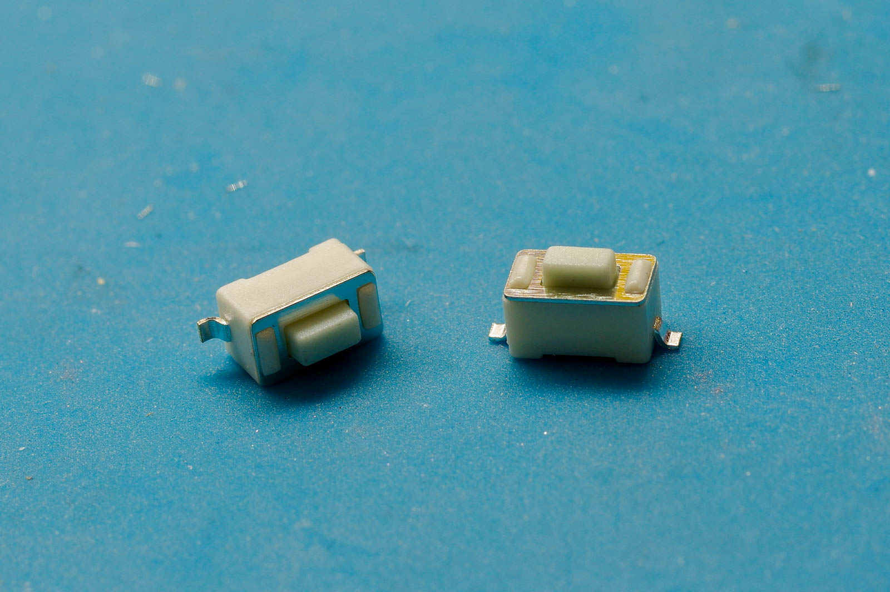

I could not find any footprints for these in the KiCAD library.  The
files probably exist somewhere on the internet, but it's really quite
fast and easy to make a custom one in KiCAD (using the Footprint Editor),
and that is what I did:

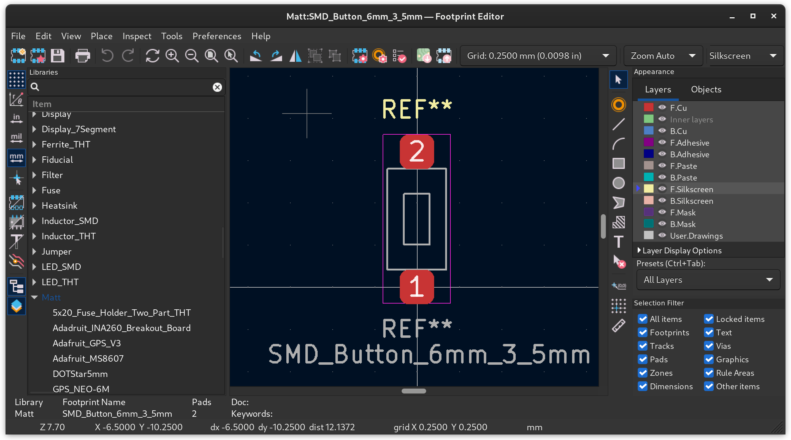

[John's Basement, video #12](https://www.youtube.com/watch?v=Rdm5lS_sYsc&list=PL3by7evD3F51fKkyrUbH-PCdwPCWc9F8a&index=14)
demonstrates how to do this.

Of course, you can just use the one I already placed in the `examples/`
folder if you are going with the same button and want to focus more on the
CNC steps.

Here is the completed/routed PCB.

> **Beginner Note** this circuit doesn't have a ground fill place
  because the schematic has no ground, which is a bit unusual.  For a design
  with a ground, you'll want to Google search how to do a "ground fill" in
  KiCAD as it can simplify wiring and help reduce electrical noise in your
  circuit.

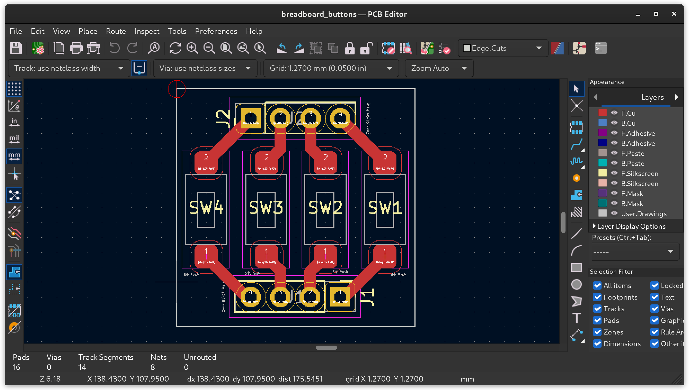

One more thing about KiCAD PCB design.  If you choose `File -> Board Setup...`
in the PCB editor, you'll should see a dialog of settings, one of which is
`Design Rules: Constraints`:

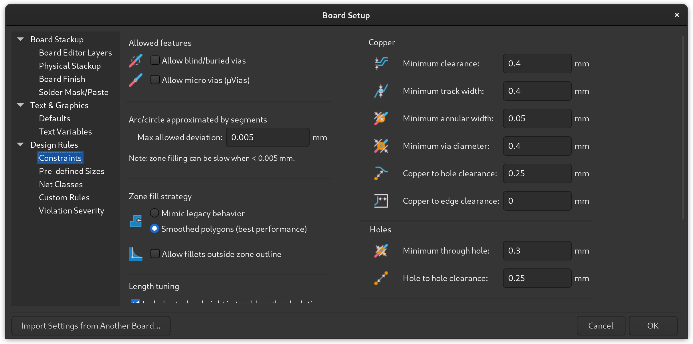

Here, there is a "minimum clearance" and "minimum track width" setting that you
can use to make your CNC life easier (in trade for limiting the ability to
route tiny parts).  I think 0.4mm for both settings is a good setting because:

   * You can use bits with a thicker point of contact (e.g. 0.3mm vs 0.1mm).
     Thicker contact points will be harder to break.
   * If you cut a but deeper (or rougher) than expected, the conservative
     minimum track width setting will increase the chance there is still some
     metal there to complete the connection.

of course, this is *just for less-complex designs that can support it*.  Once
you have a dialed-in process, you can push these number as small as you want to
try for.

## Making Gerber & Drill Files

Regardless of what tool I used to design the PCB, I'll need to export the
design in a universal format that the next phase of the process can understand.
These files are known as "Gerber" files and are like a "PDF" or "STL"  for
circuits meaning that they capture only the shapes of the PCB layout and not
other information, such as the associated schematic.

In KiCAD, you create Gerber files using the `File -> Plot`.  Here is the dialog
with the settings I use:

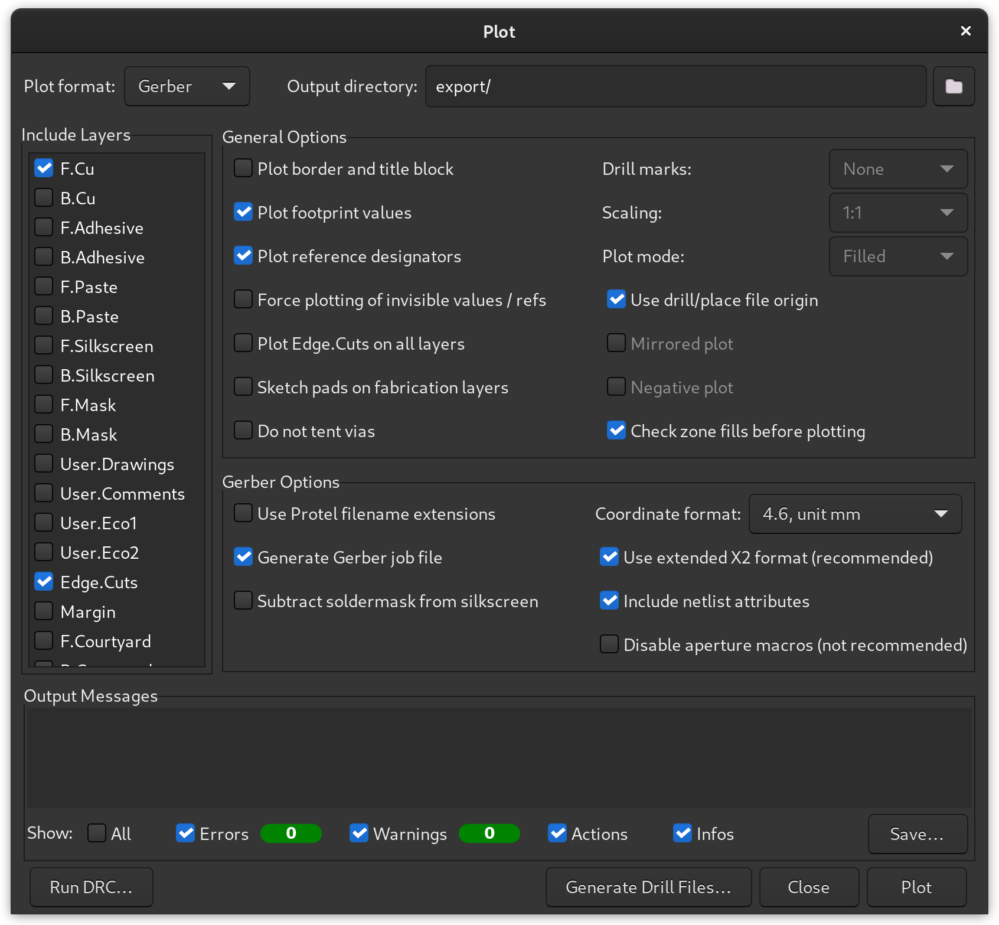

Note that I'm only exporting the F.CU and Edge.Cuts layers.  If you were
sending these files to a Fab, they would want other layers, like the silkscreen
layer, but the CNC machine can not directly make use of these (at least not in
the process I describe here).

This particular design needs holes drilled for the pin headers and
that data needs to be exported too.  "Generate Drill Files..." in the dialog
above will bring up this one.

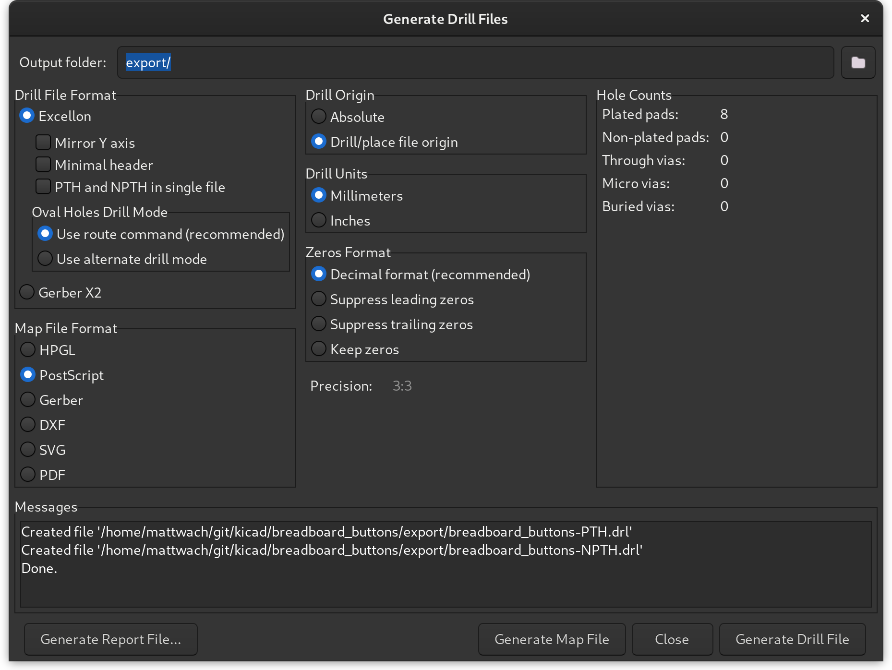

Output are "PTH" and "NPTH" files.  Those stand for "plated hole" and "non
plated hole".  This design only has plated holes but, if you have mounting
holes, then both files might have some data in them.

## Gerber to GCode (using Flatcam)

There are a number of tools to do this as well.  One that I like is
[Cambam](www.cambam.info), which is a great all-around CNC program that can
import the files above.

But Cambam is not a free program so we are going to go with Flatcam, which is
free.  Flatcam is a bit more complex than it needs to be and is not bug-free
but it get's the job done once you find a navigation path through it's large
set of options.

Let's start the software:

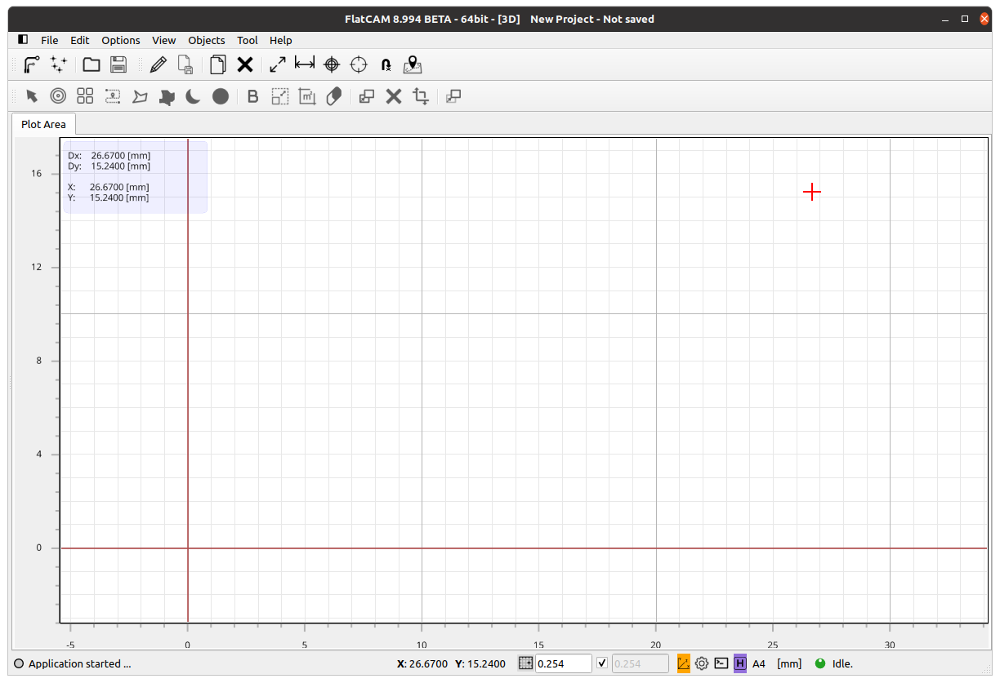

> **Tip** The very first thing I recommend doing is saving your project.
  I also suggest adding the project file to version control.

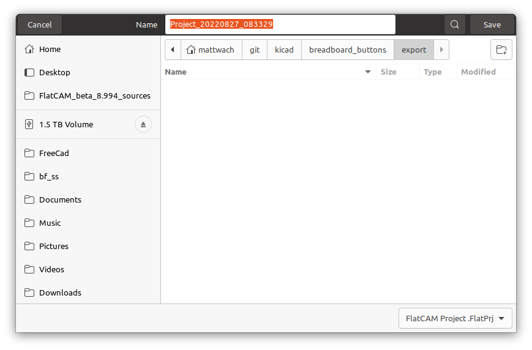

Let's load up all of the Gerber files

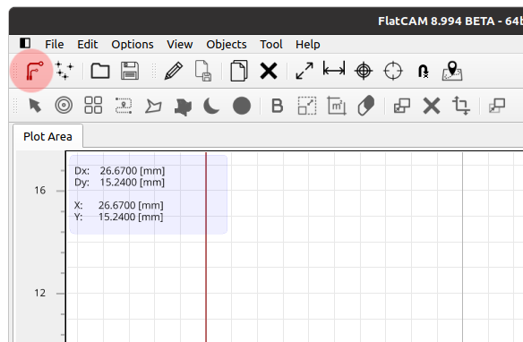
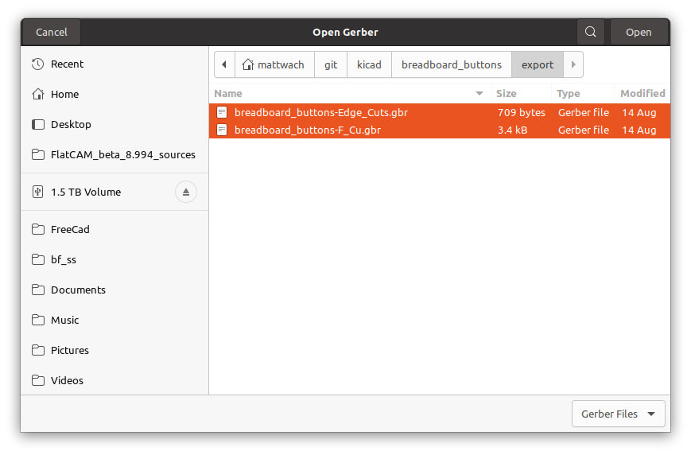

and drill files

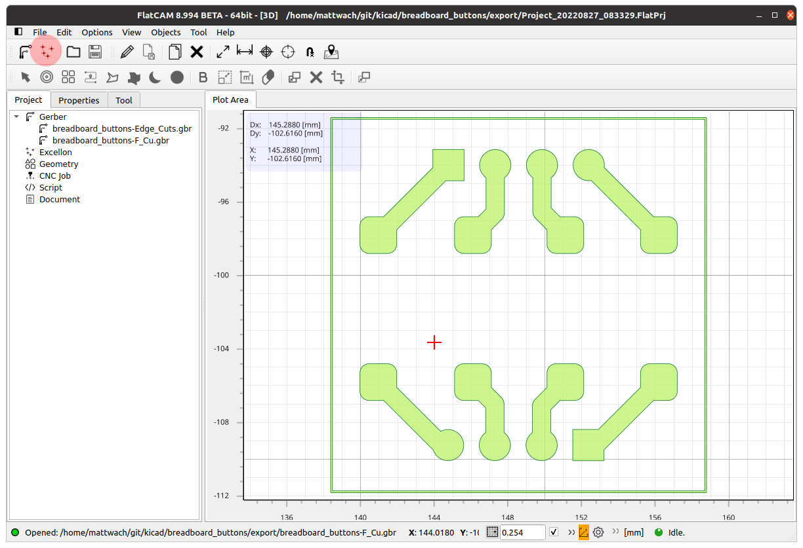
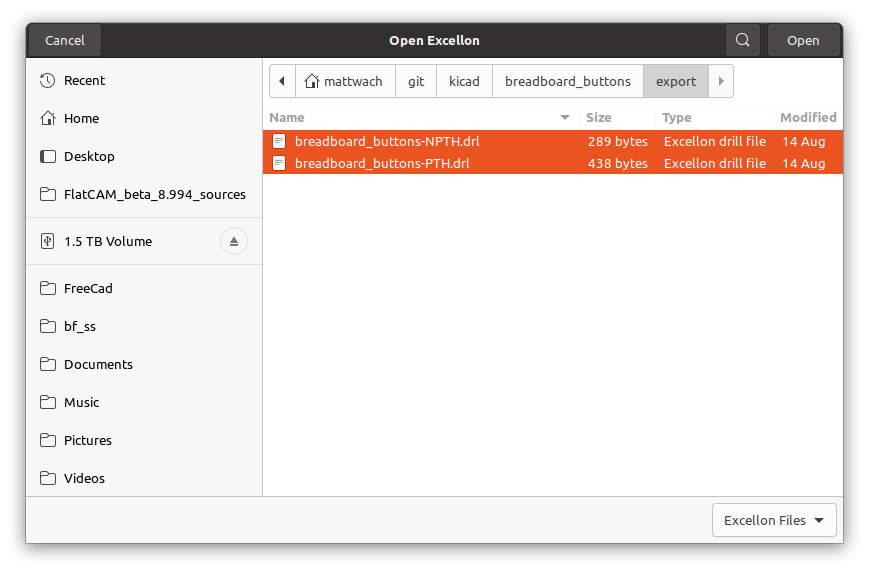

and here is the design loaded:

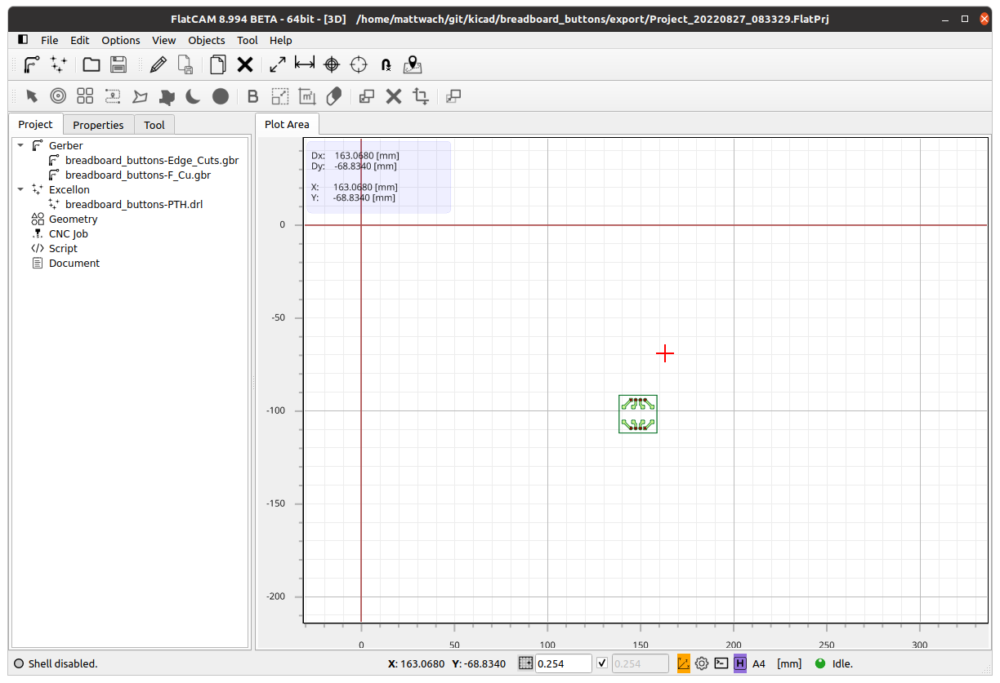

Note the horizontal and vertical red lines.  These will be the [0, 0] origin of
the CNC machine.  It's not in a good spot above because, I forgot to check "Use
drill/place origin" in the KiCAD Gerber plot dialog.  I can go back to KiCAD and
replot but flatcam has a tool as well:

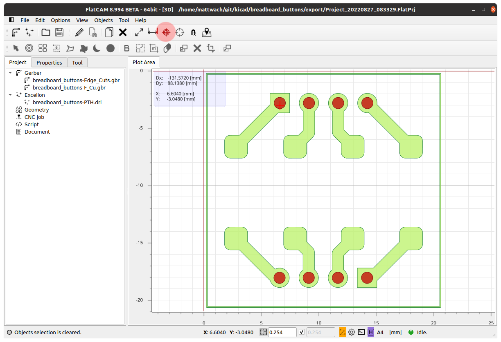

You can put the origin wherever you want and may wonder why I didn't choose the
bottom left corner (as the bottom left aligns better with CNC coordinates).
The reason is because of where I solder my heighmap probe.  I cover the
details in the CNC section.

Now is a good time to save the project.

### Copper Isolation GCode

Now we are going to start making GCode, starting (arbitrarily) with the
copper layer.  Select the copper layer, then "properties":

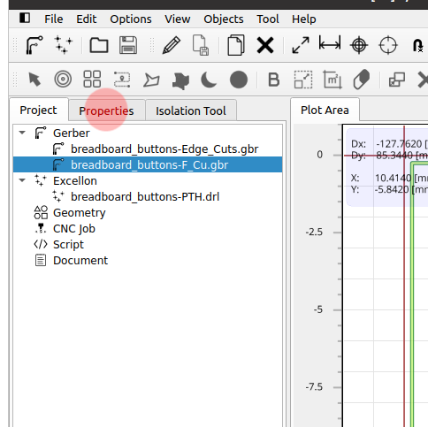

The properties dialog is a launchpad for doing a number of things.  For the
copper layer, we want to choose "Isolation routing"

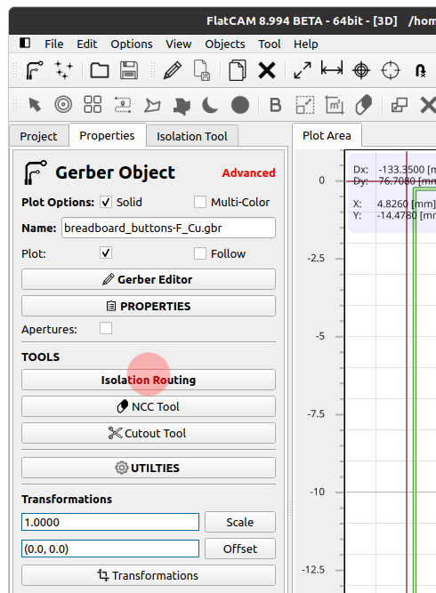

Now we are here:

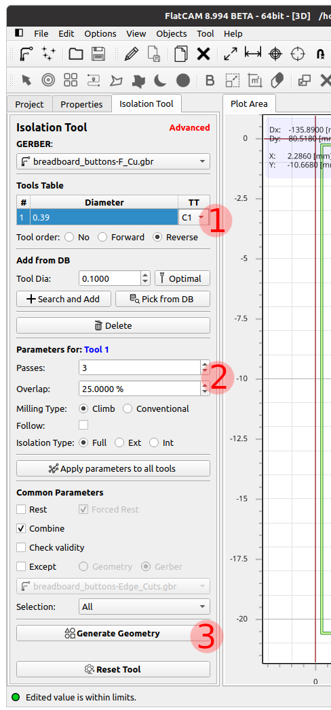

#### Step 1

   * Here we choose the bit type and properties.  These settings are complexity
     overkill, in my opinion.  The intent is that the tool wants to help
     you calculate the needed depth for V bits to get the isolation width
     you want.  The reality is that the tool assumes your machine and process
     have perfect tolerances (e.g. no bit runout, perfect cuts, perfect
     positioning).  If any of these are untrue (and the probably are on a
     3018), then you just end up putting in adjusted numbers anyway to get the
     final result to come out.

   * To keep it simple, I directly choose the final cut width.  I do this
     by choosing a "C1" bit type and typing in the expected cut width.
     I'm essentially telling the tool "trust me, the cuts will be 0.39mm wide".
     If the real cuts are a little wider or narrower, it's usually not a problem
     unless the real cuts are so much wider that you lose copper traces.

   * I chose 0.39mm because I chose 0.4mm isolation widths in KiCAD.  See
     The KiCAD Design section above for a refresher on how I did this.
     **You need to choose a smaller number in flatcam than kicad** or flatcam
     will silently omit traces where it can't fit a line.

   * Keeping it simple makes the "Add from DB" section irrelevant so we can
     skip it.

#### Step 2

   * The main options here are "Passes" and "overlap"

   * Passes are the number of cut lines to make around each trace.

   * Overlap is how much to overlap the passes.  Too little overlap will lead
     to small bit of copper remaining between each pass, which usually isn't a
     big deal, but doesn't look as nice.

   * "Follow" and "Isolation Type" can be kept at default settings.

#### Step 3

   * Create the geometry traces for out next step.  You can actually click
     this button multiple times (presumably with different settings) to
     create multiple geometries - then ignore, hide or delete the
     ones you are not planning to use.

#### Here are results with 3 passes and 25% overlap

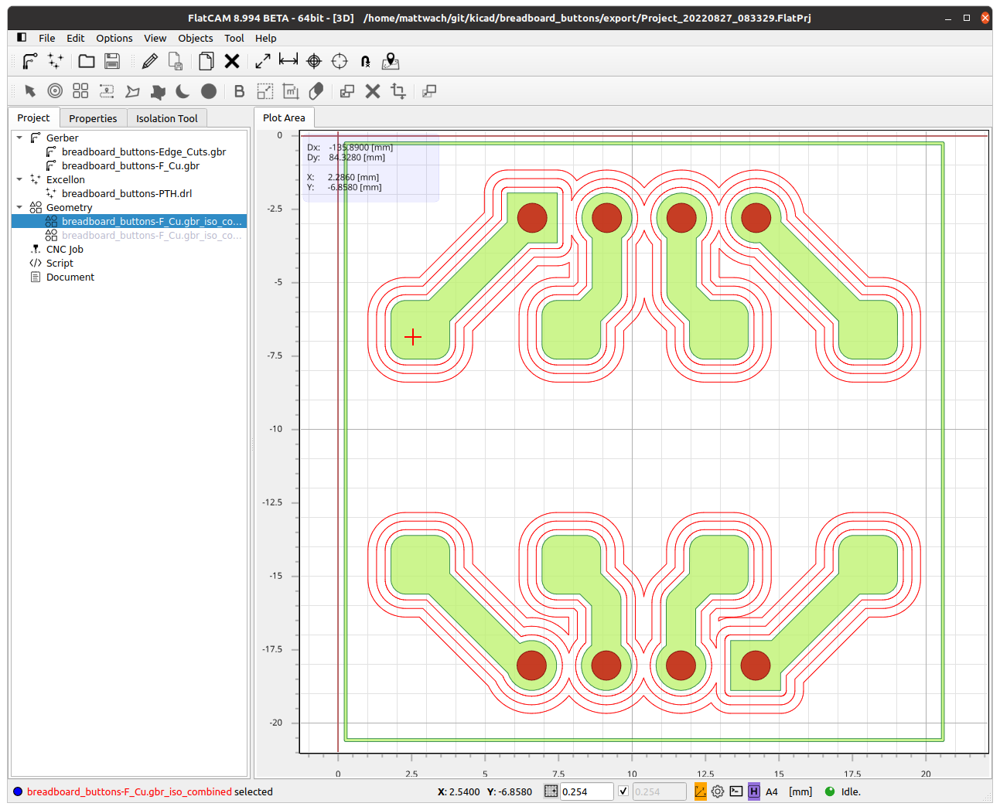

#### and 2 passes and 10% overlap

Note that both are included in the project at this point.  I
like the three pass version better so I'm going to right click
on the 2 pass version and delete it.

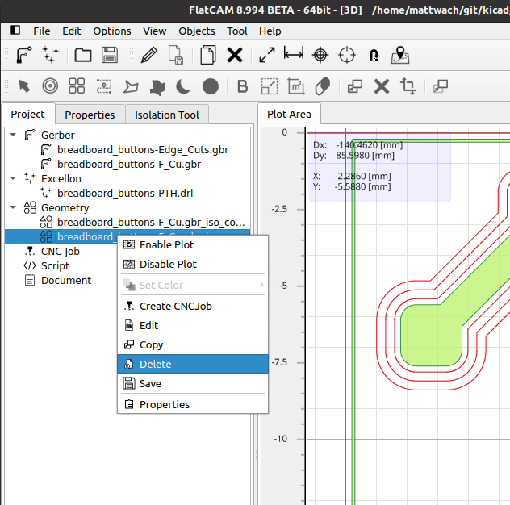

> **Tip** Now is a good time to save (and possible version control snapshot)

One more step.  At this point we need to create the final gcode file.  To do
this flatcam needs more information.  Click on the geometry object, then properties:

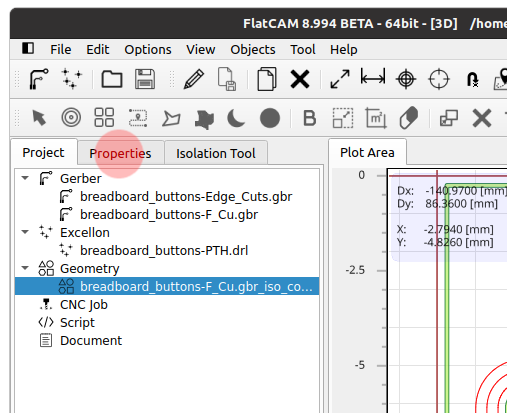

and we are onto this dialog:

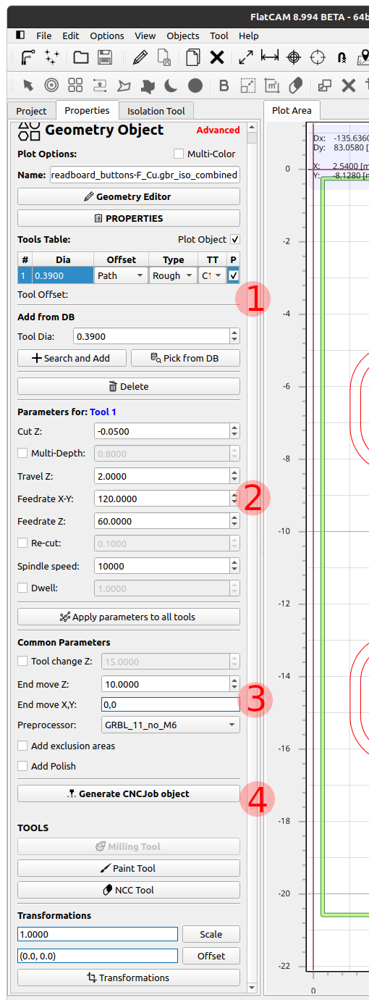

#### Step 1

   * This section helps you calculate your cut depth if you are using a V
     bit.  As I said earlier, I find it easier to choose the "C1" bit type
     and put in the depth myself.  Thus if you are following my path,
     **you can simply ignore this section**.

#### Step 2

   * Cut Z: How deep to cut.  A very important parameter.  With a V bit, it also
     will determine your cut width (deeper cuts wider due to the V shape).  Cut 
     depth also has a big effect on how likely you are to break a bit.  **When
     in doubt, choose a small number here, like -0.03** - the penalty of cutting
     too shallow is that you need to cut again deeper which is very quick to do
     with the tools I talk about later (candle_heightmaap_adjust.py).
   * Multidepth.  This setting allows, you to split your cut into multiple passes.
     Using my `candle_heightmap_ajust.py` tool, I can do this "at the machine" as
     needed, thus **I don't use this option for copper isolation**.
   * Travel Z: How high to hover the bit over the board when not cutting.
     **Defaults are fine** but your job will finish quicker on a complex board if
     you set it lower.
   * Feedrate X-Y: How fast to cut in the XY direction.  I use settings in the
     120 to 200 range and found through controlled experiments that the quality
     was similar.  There is surely too high of a setting where quality and bit
     health will suffer and of course that limit will depend on which bit you
     choose.
   * Feedrate Z: How fast to plunge.  I find the **default setting of 60 to be ok**
     and have not experimented further.
   * Spindle Speed: RPM of the motor.  With a stock 3018, this number is not
     accurate becuase these machines have no RPM sensor.
     **10000 basically means "full power"** which will be ~7500 RPM in with a
     typical 3018 stock motor.

#### Step 3

   * End Move X,Y,Z: Where you want the bit to end up when the job is done.
     **I find ending at a x,y of 0,0 is nice for changing to the next bit**.
   * Preprocessor: Used to tailor the GCode output to a type of machine.  If
     you have a 3018 machine, you probably want a GRBL variant.  You can also
     make your own template from an existing one - something to consider
     after you get more experience with the process.

#### Step 4

   * Click "Generate CNC object"

#### Now you have a "simulated" CNC plot and an option to save it.

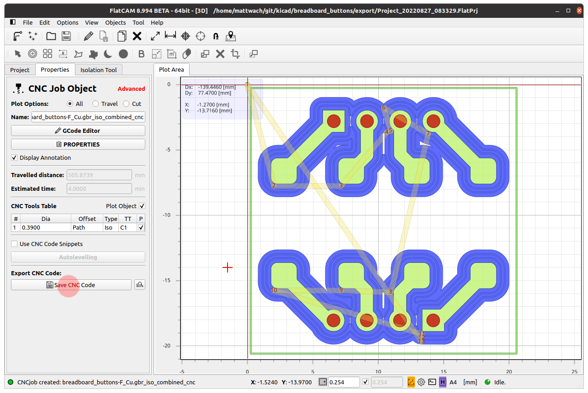

Here is a quick look at what was saved:

    (G-CODE GENERATED BY FLATCAM v8.994 - www.flatcam.org - Version Date: 2020/11/7)
    
    (Name: breadboard_buttons-F_Cu.gbr_iso_combined_cnc)
    (Type: G-code from Geometry)
    (Units: MM)
    
    (Created on Saturday, 27 August 2022 at 10:30)
    
    (This preprocessor is used with a motion controller loaded with GRBL firmware.)
    (It is configured to be compatible with almost any version of GRBL firmware.)
    
    (... MORE COMMENTS REMOVED ...)

    G21
    G90
    G17
    G94

    G01 F120.00
    
    M5             
    G00 Z15.0000
    G00 X0.0000 Y0.0000                
    ( --- LOOK HERE --- )
    T1
    (MSG, Change to Tool Dia = 0.3900)
    M0
    G00 Z15.0000
            
    M03 S10000.0
    G01 F120.00
    G00 X2.0236 Y-7.7442
    G01 F60.00
    G01 Z-0.0500
    G01 F120.00
    G01 X2.0370 Y-7.7495 F120.00
    G01 X2.0923 Y-7.7691 F120.00
    G01 X2.1584 Y-7.7856 F120.00
    G01 X2.2259 Y-7.7957 F120.00
    (... MORE COMMANDS ...)

Check out the `LOOK HERE` section above.  My particular machine does not like
the `T1` (tool change) code.  I can just delete it and move on but this is an
extra step.  Creating a custom template (beyond the scope of this document but not
hard), can allow the generate file to never add the code.
The takeaway for now is that the CNC "dry run", explained later,
might produce errors and these errors might require you to change the gcode file a
bit.

Another thing to look for is the `M03 S10000.0` line.  If you forgot to set your
RPM (left it at zero), this line will be missing and you will be sad when the
not-spinning bit breaks on the copper plate.  Checking cut depth is also advised.

Wouldn't it be nice if the computer did all of this checking for you?
I the tools I have included do exactly that (`check_pcb_cu.py <filename>`)
Computers are way better than me at checking everything so I just run the
check tool every time to help find unintentional "typo" settings I put into
flatcam.  For example, I once put -0.5mm instead of -0.05mm for my cut depth
and broke 3 bits before disovering it! (which led to my creating the check
tool to begin with).  More details on that later...

Anyway, lets move on to the other cuts.

### Drills

I'll arbitrarily work on the drills next.
First I disable (not delete) the isolation geometry and CNC cuts to clean up
the plot a bit:

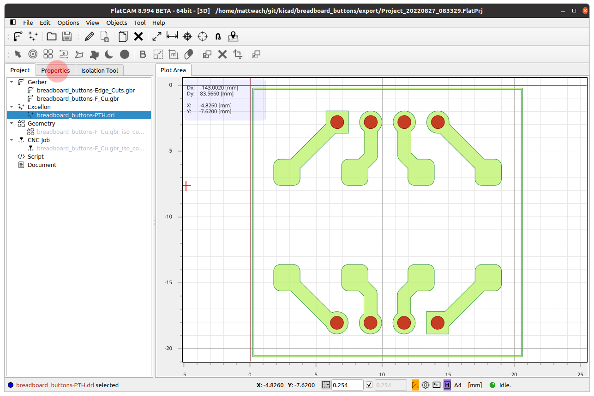

Taking a look at the dialog

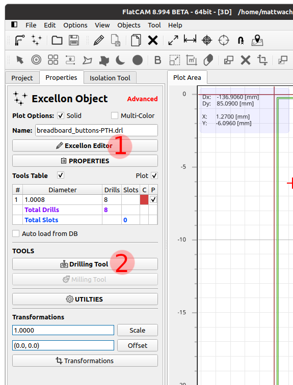

Number 1 above is the "Excellon Editor".  For this project we have 8 holes
to drill and they are all the same size so **we don't need this option**.
But, this option *is* often useful as it is often the case where you have
several drill sizes (like 0.85, 0.9, 0.95) and you want to combine
them all into a single size (all 0.9 for example) to make your drilling
process easier.

Number 2 is the drilling tool.  Lets click it:

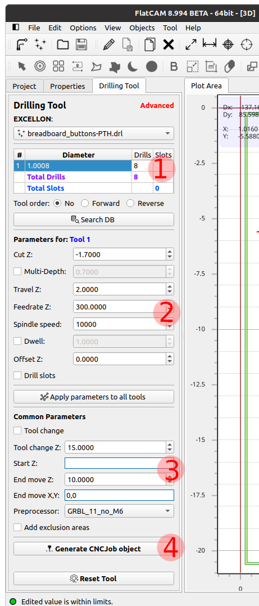

   1. The drills you want to include in this file.  We only
      have one type in this example, so nothing futher to do here.
   2. How deep and fast you want to drill.
     * Cut Z: should be the same as your board thickness, maybe plus 0.1mm or so.
     * Multidepth:  Should not be needed for drilling
     * Travel Z: hover height.  default is fine.
     * Feedrate Z: cut speed.  Depends on the bit you use and the
       diameter of the hole.  For small holes, the 300 setting is fine.
     * Spindle Speed: Explained in the previous (copper) section
     * Offset Z: It's just added to Cut Z for tapered bit.  Or you
       could have just changed Cut Z directly so I'm not sure why this
       exists.
   3. It's all the same as the copper section (common parameters)
   4. Click here to make your drills

Now the drill paths are made and it's time to save the gcode file:

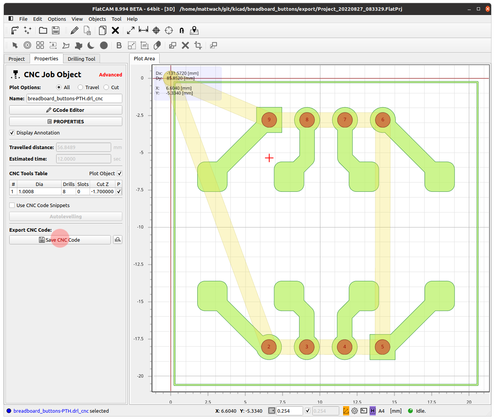

Let's move onto the final cut, the edge cuts (cutting out the board outline).
Again, I disable unneeded plots to clean up the display a bit.

### Edge Properties

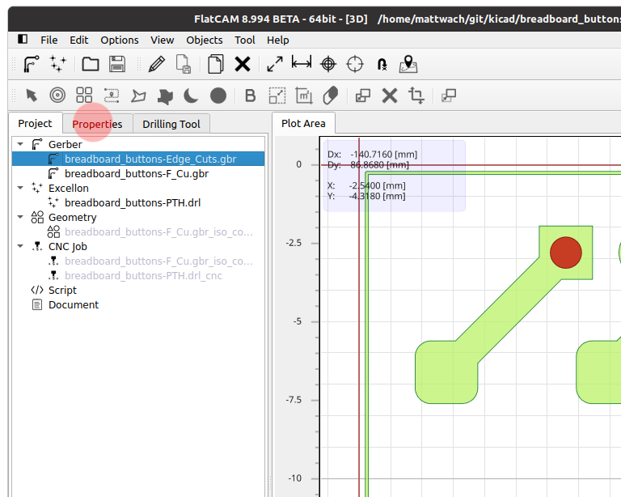

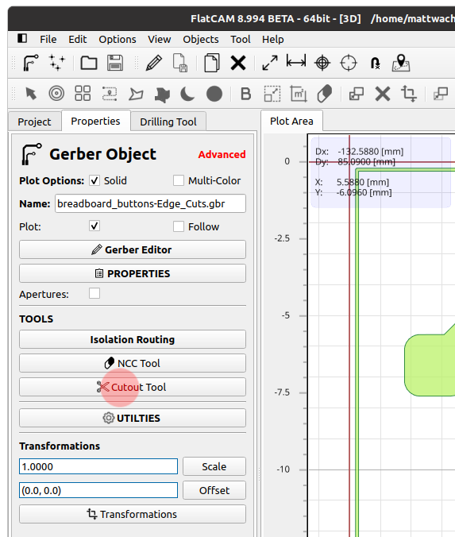

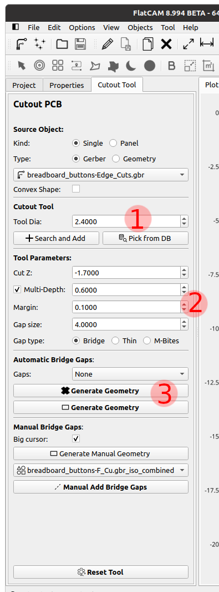

   1. Set this to the diameter of your cutout bit.  I usually do with
      something in the 2-3mm range here (and all have worked fine)
   2. The defaults as-shown work fine for me.  Set Cut-Z to the thickness of
      your board plus 0.1mm.  Here we do want "multidepth"
      selected so that the bit takes several passes to do the cut as trying to
      cut everything in one pass would put a lot of load on the cutting bit.
   3. I have "Bridge Gaps" set to none.  If you set it to something else
      (like 4), then the CNC machine will leave small tabs that connect the
      board to the copper clad.  This is important or not important depending
      on how you have your copper clad secured.  I use the "double sided tape"
      method (described in the CNC section) so I do not need any tabs.

 When you are all set, click on "Generate Geometry" (top one).  On my version of
flatcam, I had to manually select the "properties" tab after doing this but
you might not need to.

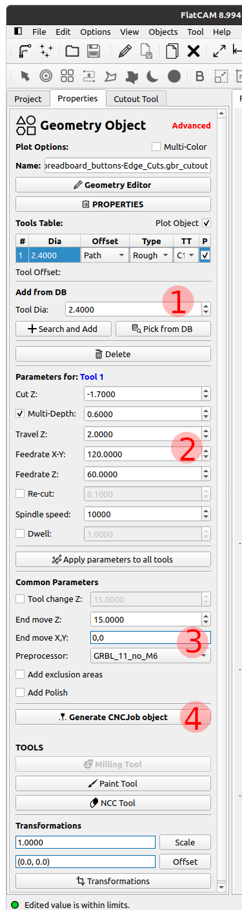

   1. Verify this is the width of your cutting bit
   2. The parameters are similar to the copper section except that
      we are going with multidepth for this cut.  Make sure spindle
      RPM is not zero.
   3. The common section is the same as the copper section.  Make
      sure that the Preprocessor is set as-described in the copper section.
      Note that changing the Preprocessor can mess with other settings so
      check them over after making any changes.
   4. Generate the tool paths

All that is left to do is export the gcode:

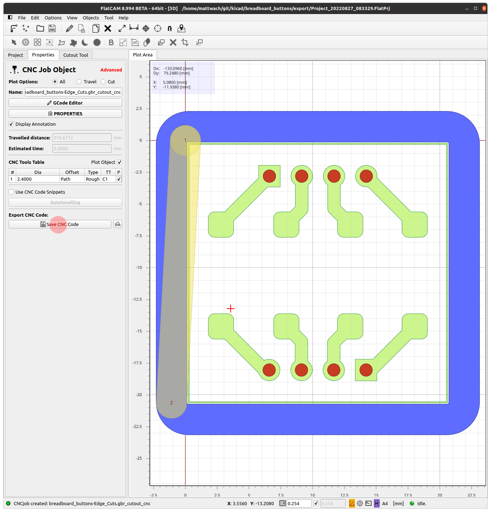

And we are done!  It may have seemed like a lot of work but it goes pretty
quick (a few minutes) after you've done it a few times.  The bigger issue is
accidentally putting in a wrong number somewhere.  I have a solution that I
describe in the next section.

I suggest saving your project and check it into version control.  I also like
to commit all of my gcode files to version control so I can look at them later
if need-be.

### CGode Validation (Optional)

Sometimes when driving the creation tools (in this case KiCAD and Flatcam), I
accidentally enter an incorrect value in one of the parameter dialogs.  The
example I'll share is that I once entered -0.45mm for a z-cut depth into the
copper - what I meant to enter was -0.045mm.  The result what that I broke a
$15 bit and two more $2 bits before finding the problem.

The solution I came up with is "validation" scripts.  These are simple [Python](python.org)
scripts that you feed your final GCode into.  They read in the code and look
for problems.  The problem I mentioned in the previous paragraph will be caught
by the checking program along with many others.  Which problems exactly?  Well that is
ultimately up to you.  I provide my own configuration and I tried to make it
easy to modify it for whatever things you want to check - you can make it as
rigid or flexible as you want.

Here is the actual output of running the three gcode files I generated earlier in
Flatcam.

First the copper check.

    python3 check_pcb_cu.py breadboard_buttons-F_Cu.gbr_iso_combined_cnc.nc
    
    Properties:
      lines: 5063
      codes: 5029
      units: {'MM'}
      xrange: 0.0 .. 19.814
      yrange: -19.664 .. 0.0
      zrange: -0.05 .. 15.0
      max_plunge_feed_z: 60.0
      max_cut_feed_xy: 120.0
    
    Spinning in material: OK
    min_x: 0.0 > -1.0: OK
    max_x: 19.814 < 60.0: OK
    min_y: -19.664 > -40.0: OK
    max_y: 0.0 < 1.0: OK
    min_z: -0.05 > -0.1: OK
    max_z: 15.0 < 15.1: OK
    max_z_plunge: 0.05 <= 0.05: OK
    max_plunge_feed_z: 60.0 <= 61.0: OK
    max_cut_feed_xy: 120.0 <= 180.0: OK
    T1 not present: OK

Let's dig into this one a bit.  The first thing the script does is read the
file. Then some basic properties are printed.  These are just informational.
Finally the checks. Now let's look at the `check_pcb_cu.py` script that we ran:

    #!/usr/bin/env python3
    
    import check_gcode
    
    check = check_gcode.GCodeChecker()
    check.dump_properties()
    check.assert_spinning()
    check.assert_gt('min_x', check.min_x(), -1.0)
    check.assert_lt('max_x', check.max_x(), 60.0)
    check.assert_gt('min_y', check.min_y(), -40.0)
    check.assert_lt('max_y', check.max_y(), 1.0)
    check.assert_gt('min_z', check.min_z(), -0.1)
    check.assert_lt('max_z', check.max_z(), 15.1)
    check.assert_lte('max_z_plunge', check.max_z_plunge(), 0.05)
    check.assert_lte('max_plunge_feed_z', check.max_plunge_feed_z(), 61.0)
    check.assert_lte('max_cut_feed_xy', check.max_cut_feed_xy(), 180.0)
    # T1 may not be supported by your CNC machine
    check.assert_false('T1 not present', check.has_code('T01'))

This script is a simple set of rules.  Note how the checks in `check_pcb_cu.py`
match right up with the output printed when the tool is run.

You can definitely change rules, add your own or remove rules to mold the
checks to work with your setup.  Here is a basic list of *aggregation*
functions that you can choose from (all coded up in the
relatively-straightforward `check_gcode.py` file):

> Note: An aggregation takes a set of values and returns a single one.

   * `min_x(), min_y(), min_z()`: These represent the minimum bit coordinates
     present in the entire gcode file.  Checking these allows us to tell if we
     put the origin in an unexpected spot, accidently chose too big of a design
     to cut, or accidently set a final cut depth too deep.
   * `max_x(), max_y(), max_z()`: These represent the maximum bit coordinates
     present in the entire gcode file.  Checking these allows us to assert
     the design is not too big and that the final z position is not too high,
     where it would be in danger of striking hitting it's upper limit.
   * `max_z_plunge()`: This represents the maximum single-step change in z
     while cutting.  Changing Z too much in a single pass can break a bit.
   * `max_plunge_feed_z()`: This represents how fast the bit plunges into
     the PCB.
   * `max_cut_feed_xy()`: This represents the maximum cut speed in XY
     plane (across the surface of the PCB).
   * `has_code()`: This returns True if a gcode (such as `T01`) is found anywhere
     in the file.  This is useful for detecting codes that your machine does
     not know how to process.

Below are some asserts that you can wrap around the aggregations above.
An assert is like an "if" statement, where failing the assert will lead to the
program returning an error when it exits:

   * `assert_true(message, condition)`: Fails with `message` if `condition` is
     false.
   * `assert_false(message, condition)`: Fails with `message` if `condition` is
     true.
   * `assert_gt(message, value, reference)`: Fails with `message` if `value` is <= `reference`.
   * `assert_lt(message, value, reference)`: Fails with `message` if `value` is >= `reference`.
   * `assert_gte(message, value, reference)`: Fails with `message` if `value` is < `reference`.
   * `assert_lte(message, value, reference)`: Fails with `message` if `value` is > `reference`.
   * `assert_spinning()`: Fails if the bit is ever not spinning when `z < 0.0`

See the existing files for real-world examples.  Feel free to add your own
checks or functions as needed.

Back to the example, here is example output from the drill checker:

    python3 check_pcb_drill.py breadboard_buttons-PTH.drl_cnc.nc 
    Properties:
      lines: 95
      codes: 47
      units: {'MM'}
      xrange: 0.0 .. 14.224
      yrange: -18.034 .. 0.0
      zrange: -1.7 .. 15.0
      max_plunge_feed_z: 300.0
      max_cut_feed_xy: 0.0
    
    Spinning in material: OK
    min_x: 0.0 > -2.0: OK
    max_x: 14.224 < 60.0: OK
    min_y: -18.034 > -40.0: OK
    max_y: 0.0 < 2.0: OK
    min_z: -1.7 > -1.8: OK
    max_z: 15.0 < 15.1: OK
    max_z_plunge: 1.7 < 1.8: OK
    max_cut_feed_xy: 0.0 <= 0.0: OK
    T1 not present: OK

and finally the edge checker:

    python3 check_pcb_edge.py breadboard_buttons-Edge_Cuts.gbr_cutout_cnc.nc
    Properties:
      lines: 280
      codes: 245
      units: {'MM'}
      xrange: -1.096 .. 21.924
      yrange: -21.924 .. 1.096
      zrange: -1.7 .. 15.0
      max_plunge_feed_z: 60.0
      max_cut_feed_xy: 120.0
    
    Spinning in material: OK
    min_x: -1.096 > -2.0: OK
    max_x: 21.924 < 60.0: OK
    min_y: -21.924 > -40.0: OK
    max_y: 1.096 < 2.0: OK
    min_z: -1.7 > -1.8: OK
    max_z: 15.0 < 15.1: OK
    max_z_plunge: 0.6 <= 0.61: OK
    max_cut_feed_xy: 120.0 <= 120.0: OK
    T1 not present: OK
    Wrote /home/mattwach/git/kicad/breadboard_buttons/export/test.nc

Look at that last line.  The edge checker wrote out a gcode file because the
bottom if `check_pcb_edge.py` has this line:

    # the -1.0 padding account for an assumed 2.0 (or more) thick edge cut
    check.create_test_gcode('test_template.txt', 'test.nc', -1.0)

What is this new gcode file?  It is a rectangle that outlines your design with
a 1mm border and a z depth of 0.0.  What is that good for?  It is very useful
for machine calibration and verification.  More on that in the CNC section.

### CNC Setup

#### Machine Properties

The machine I'm working with is a 3018 Sainsmart.  I've also done this process
on a friend's differently-branded 3018 machine with success.  Many machines can
be made to work here but clearly some process adaptation will be needed.

#### Bit Choices

I did extensive and isolated testing on many different types and sizes of bits
to determine which ones I would use.  Below are the "winners" of this process,
along with sample images from the tests.

> Note: The result images are "before sanding".  When doing the tests, I thought
  that knowing how clean the cut was would be useful but I now think that post-sanding
  results would have been more useful.

##### Isolation routing

The first option is the 20 degree bits that come with many CNC machines.  These
bits can produce some fine traces and nice detail.  They are also quite cheap.

On the downside, they are not the designed for cutting PCBs and the associated
cutting stress exposes inconsistencies in quality.  I found that success with
these bits is a combination of cutting very slowly, not cutting too deeply and
getting a little lucky.

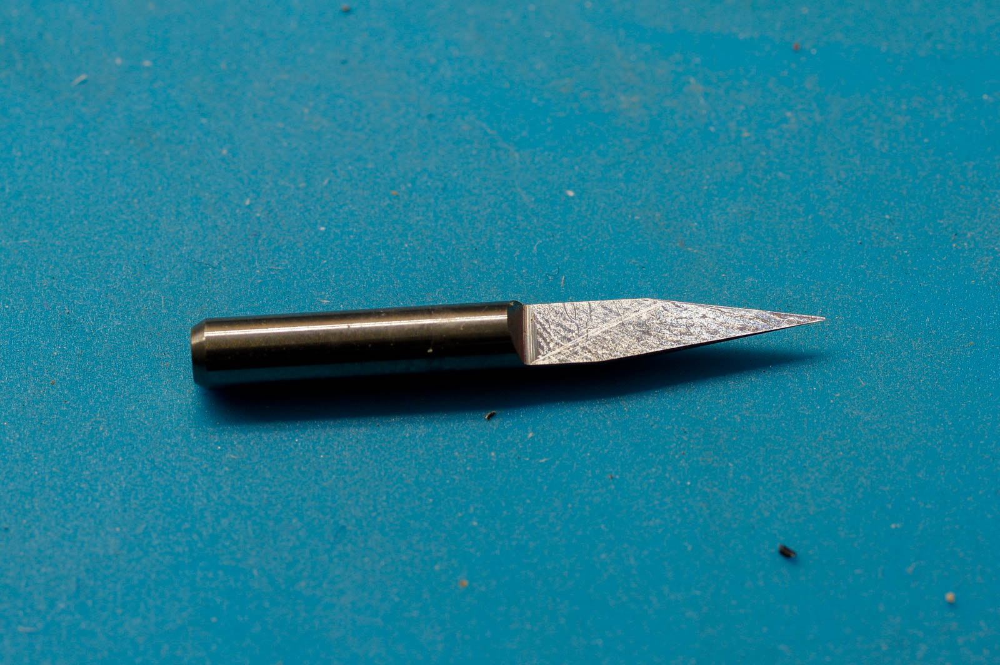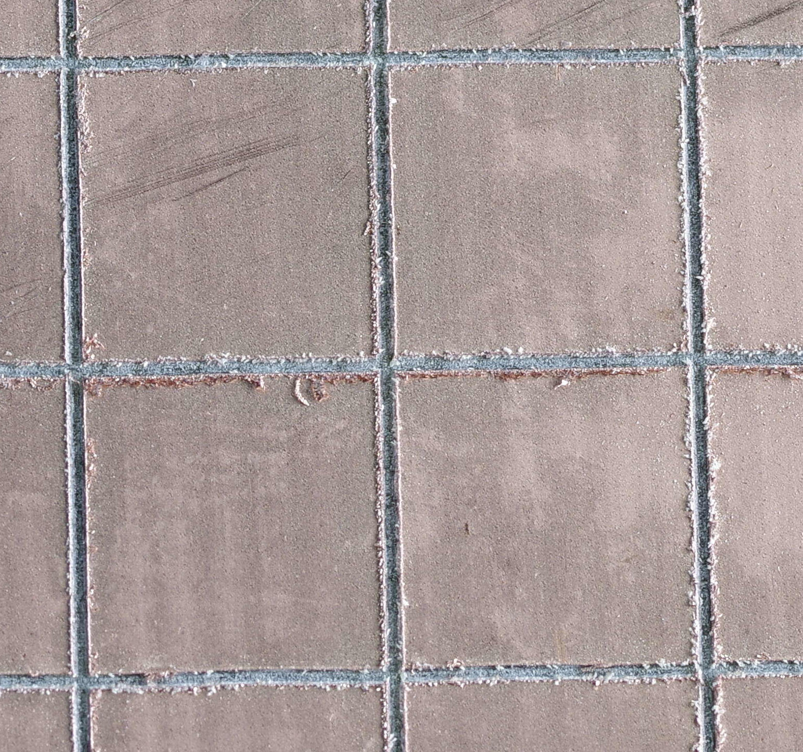

Many go for the 30 degree bits as an alternative.  These bits are a little
more robust than the 20 degree bits.  The trade-off is that cutting deeper
results in a wider track so you will not be able to get as
narrow of a track width as 20 degree if it matters (and for many projects
it does not).

Also I still think these are not an ideal choice verses the next two I will
describe.

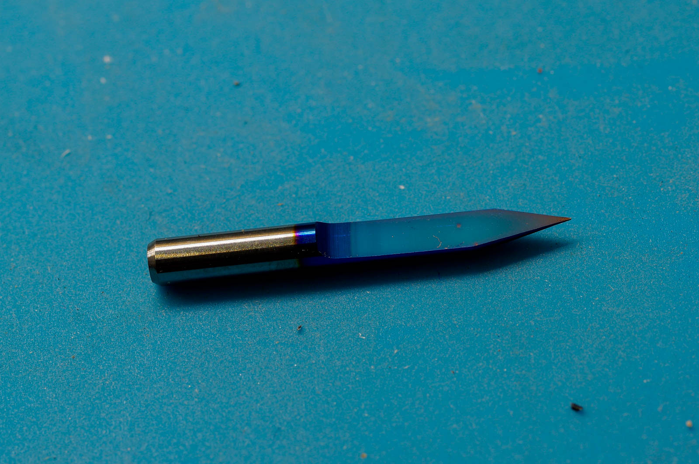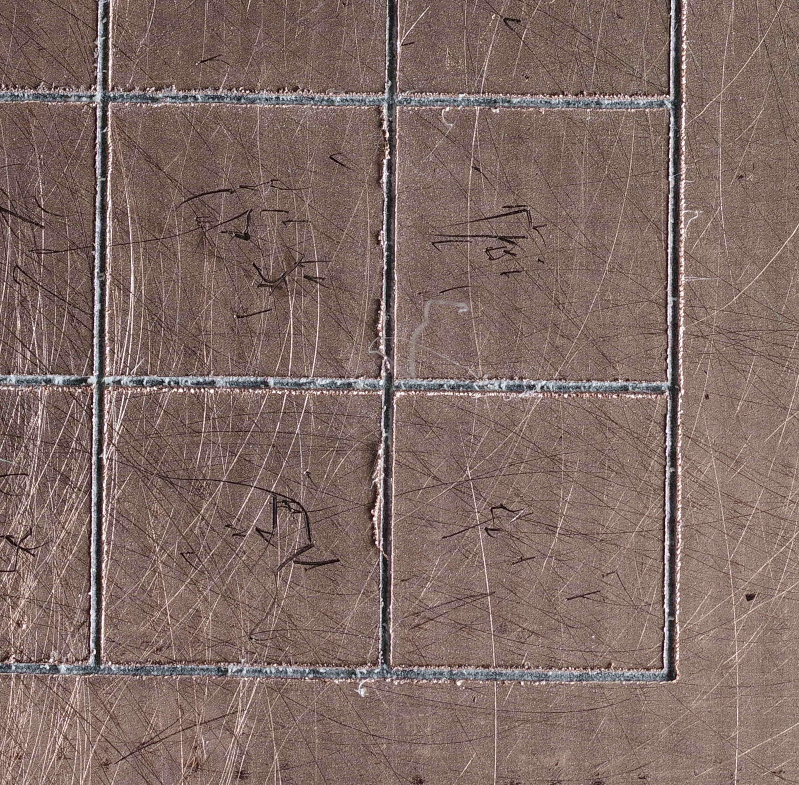

Next up are 20 degree bits with an actual cutting flutes.  I find these
to be much more robust than the previously-mentioned bits.  They are
forgiving to a wider range of cutting speeds and depths.

The downside is the minimum track width - around 0.4mm.  This may
be a non-problem or a deal-breaker depending on your project.  If you
are just starting I recommend a project that can accept this width.


I final one I'll mention is a bit that is designed for isolation routing.
I find this bit give the best overall results.  But it is $15 a bit.  These
are also a bit more fragile than the 20 degree fluted bits and you need to
watch your cut depth more closely (because they are 45 degree bits) both
in terms of cut width and avoiding a breakage.

I feel this bit is one to "graduate to" after you are confident in your
process.


##### Hole drilling

For hole drilling, you can use special purpose drill bits:


or repurpose an end-mill bit for drilling


A specialized drill bit makes cleaner cuts but I find the end-mill to be
"good enough" for those cases where you don't have a correctly-sized
drill bit handy.

##### Board cutout

Here I find a standard end-mill bit in the 2-3mm range works well.


#### Dry Run

I highly recommend doing a dry run before doing your first real cuts.  After
you get a couple sucessful project behind you, you can skip the dry run.


To do this, first connect the Candle software to your machine and start it.
Next follow these steps.

   1. Remove any bit that is in the machine
   2. Use the jogging controls to place the motor head in a safe region.  If
      you are cuttiong someting small (as recommended), the middle of the machine
      and maybe 2cm (or so) away from the board is a good spot.
   3. Click Zero XY
   4. Click Zero Z
   5. Load one of your gcode files into candle (like the edge cut file, for example)
   6. Click the "check mode" option.
   7. Click "send". This sends each gcode to the machine in a special
      mode where the machine will give errors if it gets a code it doesn't like but
      will do nothing if everything is accepted.
   8. If all is good, unclick "check mode" and click "send" again.  Now the machine will
      start spinning up and moving - it thinks it's cutting but there is no bit loaded
      and plenty of clearance so you can just watch it for unexpected behavior.  Be ready to
      click "Abort" if anything looks like it is going wrong.
      
If the machine appears to be doing the right thing, repeat steps 5-8 for each remaning
gcode files (copper isolation, drills, test file)

You might see an unrecognized gcode error in step 7.  Often these are "tool
change" codes (M6, T1) that you can delete from the gcode file with a text
editor with no ill effects.  If in doubt, look up the gcode on Google.  For
future projects, you can change the "Preprocessor" in Flatcam (or make a custom
one) that permanently omits these codes.

#### PCB Preparation

##### Painters Tape Method

A lot of CNC projects shows the part being clamped down on the edges.  Besides
creating an obstacle that your CNC bit will need to avoid, this creates a
bowing issue where the pressure of the clamp can cause the middle of the PCB to
bow up.  The precision needed for a good quality cut is around 0.02mm so this
bowing is a problem.

The solution is to use the following process.

Take a piece of blue painters tape and put in on your machine.  I like
to use a small roller to make sure it's flat.


Put another piece of painters tape on the back of your PCB.  I use a roller
here too.


Add some CA to the painters tape on the PCB.  Try not to get the glue so close
to the edge that it makes a mess.


Optional: Add CA fixing spray to the tape on the machine (a mist of water also
works).  If you are willing to wait 20ish minutes for the CA to dry, this
step can be skipped.


Press the two pieces together firmly


##### Probe Preparation

If you are going to run a height map, which I recommend doing, you'll need to
get probes setup.  If you are unfamiliar, your CNC should have a couple of
terminals where you can attach wires.  On mine and many
controllers, this is at port A5 on the controller.  When these wires short together, the CNC
firmware receives a signal which it an interpret as "contact" between the bit
and the material.  Because the bit and copper PCB are metal, they can
participate in this electrical connection.

So you simply connect one probe to the bit and one to the board.
To connect to the board, I take a little piece of wire that I clipped of from a
resistor/capacitor/whatever of an old project and solder it to some upper
corner of the board (I go upper left).


When everything is connected, you should be able to test the "zero" feature of
your CNC software (I'm using candle)


> Tip: Doing a probe like this is a bit unnerving the first time as it will be the
  first end-to-end test of your setup.  If you have an appropriate mechanical
  spring lying around, you can use it as your "bit" for testing purposes with
  your hand at the abort button in case the probe fails and the spring starts to
  compress.


#### Loading the design

I start by loading the "test.nc" file I generated by the checking software in
the verification step.

> Tip: If you did not produce this file, you can use the edge cuts file instead.


#### Zeroing the machine

If you followed my method of putting the zero point in the upper left corner,
you can zero the XY of the CNC machine just a bit under the soldered probe pad -
or whever you want so long as the design will fit.

#### Generating a height map

The z tolerance for a quality copper cut is tight.  I'd say around 0.02 mm if you are
going for 0.4mm wide traces and even tighter if you are going smaller.

To get this kind of precision, a height map will help immensely.  The way a
heightmap works is that it probes your board in a grid-like fashion, then
alters the commands that will be sent to the CNC machine to conform to the
collected data.  The result is that you will see much better depth consistency.

To generate a height map in Candle, you first click on the "Create" button under the
"height map" section on the right:


And the bottom of the window changes to a setup UI:


   1. Click the autosize button to resize the map
   2. Pick a row and column count.  More will result in a better height map in
      trade for more probing time.  I think that a grid size of ~1cm is
      acceptable so I simply take the mm dimension / 10 + 1 and round up.  In this
      case, the design is 21x21mm so I'll go with (21 / 10 + 1 = 3).   Thus a 3x3 grid to
      get an acceptably-detailed grid.  If you need more precision (due to an
      uneven PCB or finer cuts), use larger numbers (e.g. 6x6).
   3. There are also "interpolation settings".  I always set these to the same
      values as the grid ones.
   4. Now look everything over one final time and click "probe" when you are
      ready to commit.  and the machine will start to collect data.  When it
      is done, you will see something like this:


   1. Go to the File menu and chose "save".  I name my file `height.map`.
   2. Click the "Edit" button to get back out.


   1. To actually use a heightmap click "Open"
   2. Make sure that the "use heightmap" option is checked.  As you check and 
      uncheck the option you should see the design slightly change, indicating
      that your heightmap is being applied.

#### Adjusting the height map

I found that for my 3018 machine, the height map process is precise but
not accurate.  Putting it another way, I'll see errors in the height map results
of 0-0.15mm BUT this error is consistent across every point so simply shifting
all of the points leads to a good result.

Here are two approaches for dealing with this.

The way I recommend is to generate a modified version of the heightmap.  The tool,
`candle_heightmap_adjust.py` is included in this project.  Here is how I use it:

    $ python3 candle_heightmap_adjust.py --input height.map --offset 0.1
    Wrote height_offset0.1.map

This creates an new heightmap file with the requested offset applied.  Let's
compare the raw data from the two files:


As you can see, the number were all simply shifted the requested offset.

> Tip: An *alternate* approach is to manually rezero the machine slightly. 
  Get the machine to z=0 (maybe take xy off the PCB surface to be safe), then
  click the "0.1mm" or "0.01mm" resolution and click z arrows the appropriate
  number of times in the desired direction.  Then click "zero Z".


Now we can use the loaded test file to validate our depth.

   1. Load the `heightmap_offset0.1.map` file into candle and make sure "use heightmap" is checked.
   2. Click "Send"

The machine will cut a rectangle outline which should only take a minute.


You resulting cut may not have cut anything at all.  That's because you told it
to cut at a height of 0.1mm (due to the heightmap file) above the board.  If
that is the case, try repeating with a `heightmap_offset0.05.map` file and keep
repeating in 0.05mm steps until you finally see the bit make contact.

**Or** 0.1mm might be your perfect number, in which case you'll see the
lightest of contact with the board, scratching the copper but not making it
through.

**Or** 0.1mm might be cutting through to the copper.  In this case, you'll want
to make a 0.15mm file and probably go with it assuming the 0.1mm cuts were no
too deep.  The example image represents this case.

You might also find that the number you choose is inconsistent in places on the
board (sometimes cutting sometimes not).  This can happen if the board is of a
lower quality and it not actually flat enough for your chosen grid points to
capture.  If this is the case, you'll probably need to cut in multiple passes,
each 0.05mm deeper, until all of your traces are good.  This will keep your
bit from breaking (as a result of cutting too deeply).  If it's really off,
you can start over with more heightmap points, on a different part of the
copper clad.

#### Cutting the copper

At this point, you should have a nicely-calibrated heightmap file (be it the
    original, or one with an offset applied) and you are ready to cut for real.
Load your copper gcode and *reload the heightmap* (which Candle clears out on
a load).  Choose the heightmap file that gave you good results:


When your cut is finished, vacuum the cut material away and inspect the board.

It may be obvious that the bit did not cut deep enough everywhere (likely due
to a lower quality PCB).  If this is the case, you can simply rerun the
`candle_heightmap_adjust.py` file with a height 0.05mm lower, load it into
candle and rerun the cut (alternately, use the manual rezero trick described
above).  There is no need to fully rezero the machine and, in fact, doing
so will cause more harm than good.  In really bad cases, you might need to
recut incrementally more than once.

After you think the cuts are deep enough, you can sand the board.  I use 400
grit first, then 1500 grit.  It's not a long process, just a few seconds with
each.  I then use a paper towel with some isopropyl alcohol on it for a final
clean.

Now I get out my multimeter and start poking around on the board.  The main
thing to look for is unexpected shorts.  I find this usually goes pretty well,
but the boost in confidence is worth the time.

#### Drilling the holes

Drilling holes is easy compare to the copper.  You just load a bit and
rezero the Z axis for the new bit.  *Do not rezero X or Y* as this will mess up the drill
locations. I zero Z using the "paper" method where I get the bit within 2 mm
of the surface, then set the Z increment to 0.1mm.  I then move a piece of
paper between the bit and PCB while moving it down in 0.1mm increments.  When
the paper sticks, I click the Z-zero button in Candle.

> **Note** You might think to use the probes to zero the drill bit.  If you do
so, make sure there is a conductive path to the bit as the isolation routing
process may have isolated your board from the probe.  I once broke a drill bit
because I didn't think about that!

You *can* use the heightmap file here but it's not necessary as the
need-for-z-precision is lower.

Watching the machine drill the holes so efficiently and precisely is one of the
highlights of the process for me.


You may have multiple drill sizes (and thus multiple gcode files).  Just repeat
the process above for each size.

#### Board cutout

A *relatively* straight-forward task.  Load up your endmill bit and z-zero it using the
same paper technique as described in the drilling section.

For this part, I'd consider wearing a mask as it creates the most material.  My
machine does not kick the material into the air or anything, but it's still
there.


### Finishing Up

Now that everything is done, you just need to dislodge the board.  I get if off
the surface by wedging in a flathead screwdriver and work at it on a side until
it comes loose.  I usually leave the rest of the PCB on the machine so I
(might) have fewer steps to do on the next board I cut.


#### Optional: Tinning

Copper oxides over time and may not be the easiest thing to solder.  You can
buy "liquid tin" to address these "problems".  I use quotes because I don't see
signs of oxidation on 1 year+ old boards I created and because I don't find
soldering to plain copper to be too difficult.  I still like to tin my more
complex designs though.

The process is simple but you'll want rubber gloves the entire process at a
minimum for protection:

   1. Find a plastic container.  One that is barely big enough to hold your
      board is ideal.
   2. Put your board in the container and pour the liquid tin on it.  Use as
      little as you can.
   3. Wait 7-10 minutes.  Gentle agitation of the container is probably helpful.
   4. Take out your board and rinse it in warm water.

